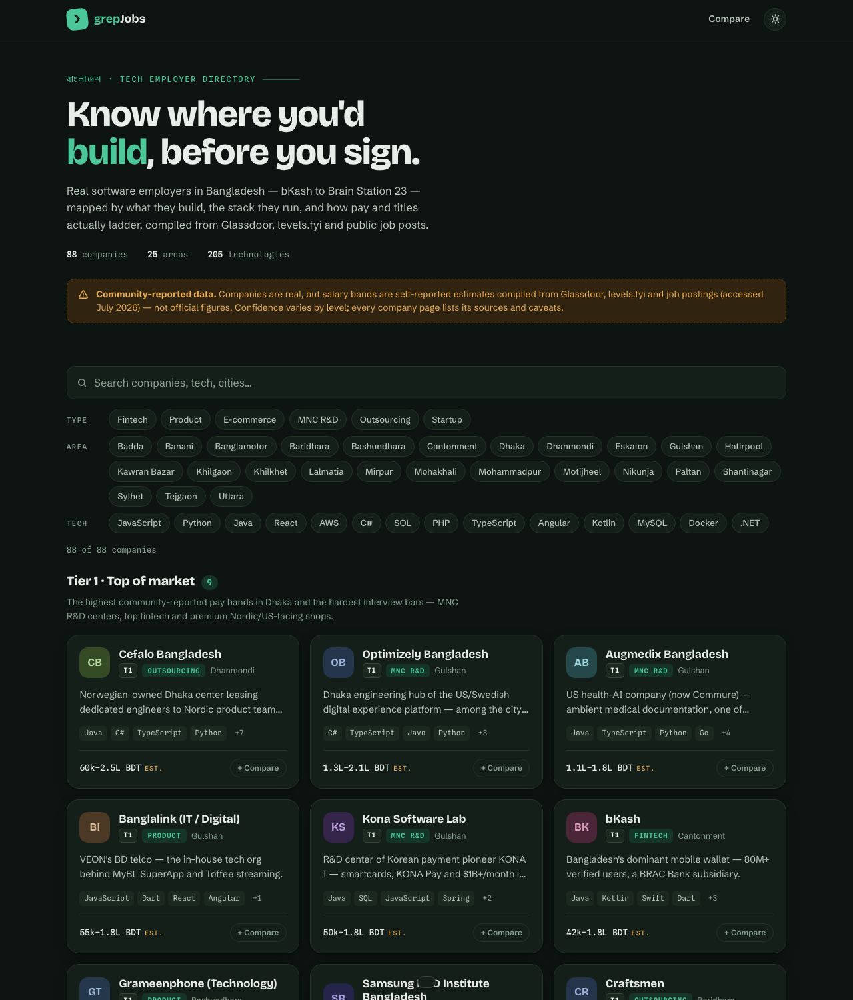
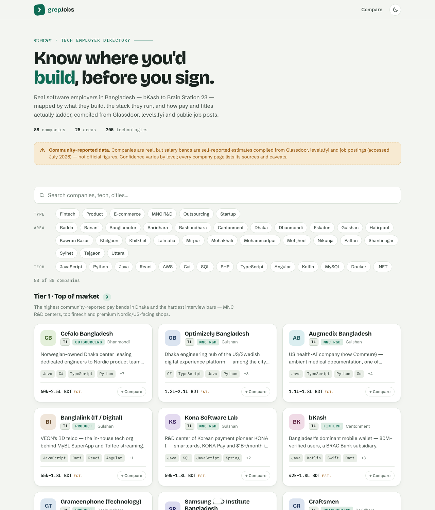
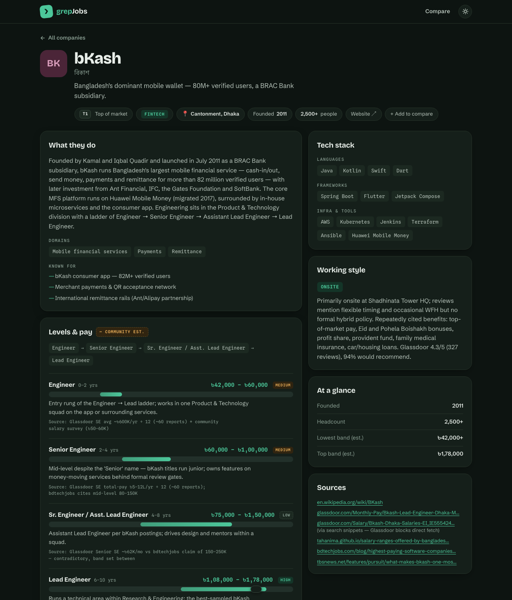
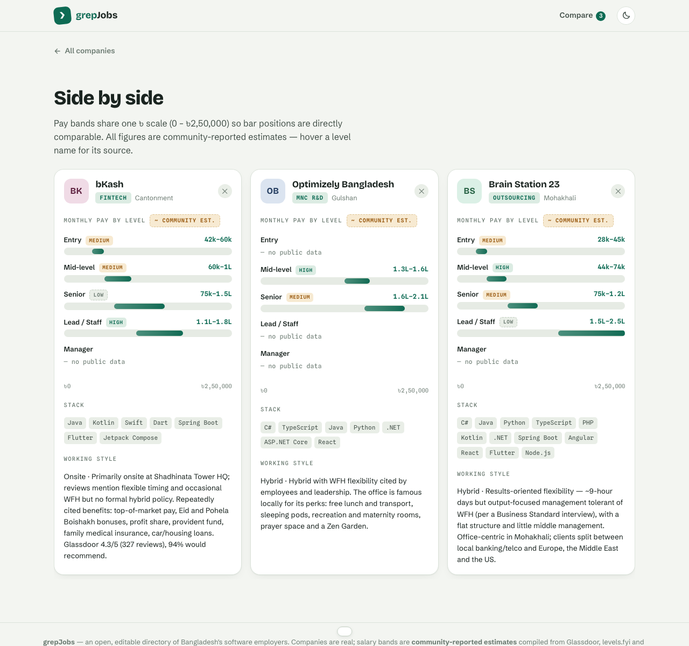

<div align="center">

# ❯ grepJobs

**A community directory of Bangladesh's software employers** — what they build,
the stacks they run, how careers ladder, and what the pay actually looks like.

[](https://msishariful.github.io/grepjobs/)


[](LICENSE)




</div>

---

## What is this?

Salary and career-ladder information for Bangladeshi tech companies is scattered
across Glassdoor snippets, Facebook groups and word of mouth. **grepJobs** puts it
in one place: **88 real companies** — from bKash and Samsung R&D to the WordPress
product cluster and Sylhet's Inverse.AI — each with:

- **Tiered placement** (Tier 1 · Top of market → Tier 3 · Entry gateways), an
  editorial grouping by community-reported pay and engineering reputation
- **Salary bands per career level** (Entry → Mid → Senior → Lead → EM) in monthly
  gross BDT, rendered on a shared ৳ scale
- **A source and confidence rating (high / medium / low) on every single band**
- **Tech stacks, domains, and "known for"** — the products and projects each
  company is actually recognized for
- **Working-style notes** — onsite/hybrid/remote, culture signals, Glassdoor ratings
- **Side-by-side comparison** of up to 3 companies on one pay scale

## ⚠️ Data honesty

This is the part that matters most:

> **Companies are real. Salary figures are community-reported estimates** compiled
> from Glassdoor, levels.fyi, BdJobs postings and community salary surveys
> (accessed July 2026) — **not figures verified by the companies.**

The dataset follows strict rules:

| Rule | In practice |
| --- | --- |
| **Never invent numbers** | 23 companies ship with *zero* salary bands because nothing verifiable exists (e.g. ShopUp's data is login-gated) |
| **Every band cites its source** | Hover any range, or read the per-level source line and confidence chip |
| **Caveats are first-class** | Each company page has a *Data notes* panel — contested figures (e.g. bKash's senior band) say so explicitly |
| **Corrections beat folklore** | Entries record where common claims failed verification (weDevs' rumored acquisition, Loop's "YC-backed" label, GraphicPeople's ownership) |
| **Reality over brand** | Daraz and foodpanda are flagged as having little/no local product engineering, whatever their consumer fame |

Spotted a wrong number? **That's the point of the repo** — see
[Contributing](#contributing).

## Screenshots

| Directory (light) | Company page (dark) | Compare |
| --- | --- | --- |
|  |  |  |

## Running locally

No build step, no dependencies — it's vanilla HTML/CSS/JS:

```sh
git clone git@github.com:msiShariful/grepjobs.git
cd grepjobs
python3 -m http.server 8000
# → http://localhost:8000
```

Or just open `index.html`.

### URL parameters

| Param | Effect |
| --- | --- |
| `?theme=light\|dark` | Force a theme (otherwise localStorage → OS preference) |
| `?compare=bkash,cefalo` | Pre-select companies for comparison |
| `#/company/<id>` | Deep-link a company page |

## Project structure

| File | Purpose |
| --- | --- |
| [`data.js`](data.js) | **The entire dataset.** One object per company; schema documented in the header comment |
| [`app.js`](app.js) | Rendering, hash routing, filters, compare logic |
| [`styles.css`](styles.css) | Design tokens (separately tuned light & dark palettes) and components |
| [`index.html`](index.html) | Shell + theme bootstrapping |

## Contributing

All content lives in **`data.js`** — corrections and additions are plain-data PRs:

1. **Fix a salary band** — edit the level's `band: [min, max]` (monthly gross BDT)
   and update its `source` string. If you have first-hand confirmation, set the
   company's `verified: true` and the amber *Community est.* badge flips to a
   green *Verified* one.
2. **Add a company** — copy any entry as a template. The schema rules that matter:
   - `id` is the URL slug; `tier` is 1–3 (definitions in the `TIERS` object)
   - each level's `key` must be one of `se1 | se2 | senior | lead | em` — this
     aligns rows in the compare view
   - every band needs a `source` and a `confidence` (`high | medium | low`)
   - **omit levels you can't source** — the UI handles missing data gracefully;
     an honest gap beats an invented number
3. **Everything derives from the data** — filters, tier sections, stats and
   compare rows update automatically; no other file needs touching.

## Disclaimer

grepJobs is an independent community project. It is not affiliated with, endorsed
by, or verified by any company listed. Salary information is aggregated from
public, self-reported sources and may be outdated or wrong — **do not treat it as
fact when negotiating**. Company names and trademarks belong to their owners;
listings are for informational purposes. To correct or remove information about
your company, open an issue.

## License

[MIT](LICENSE) © msiShariful — the code. The dataset is offered under the same
terms; attribution appreciated.
